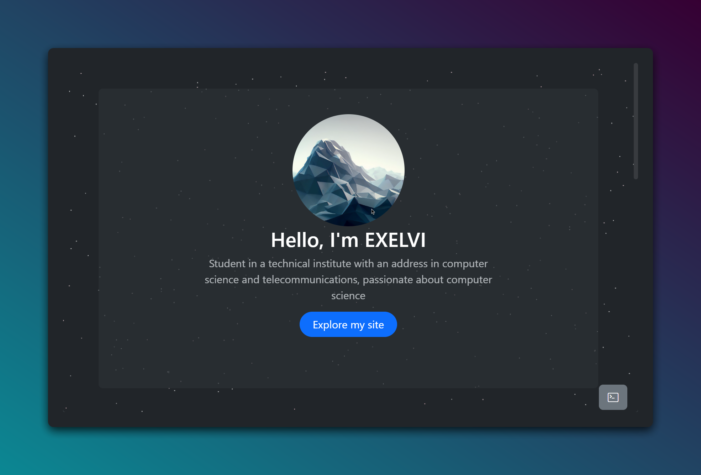

# exelvi.github.io

## Overview

Welcome to my personal portfolio website, a showcase of my projects, skills, and interests. I am a student at a technical institute specializing in computer science and telecommunications, with a deep passion for technology and programming.

This website is built using modern web technologies such as HTML, CSS, JavaScript, and Bootstrap. It features a collection of my projects, an introduction to who I am, and links to my social media profiles.

## Features

- **Responsive Design**: The website is fully responsive, ensuring a seamless experience on any device.
- **Multi-language Support**: The website supports multiple languages including Italian, English, and Spanish.
- **Interactive Projects**: Explore my latest projects with live demos and detailed descriptions.
- **Social Media Integration**: Easily connect with me on GitHub, TikTok, Instagram, and more.

## Projects

### [Random Number Generator](https://exelvi.github.io/generatore/)
A random number generator that allows users to select the quantity, range, and even exclude specific numbers. This tool also supports saving settings for later use.

### [Web-based Terminal](https://exelvi.github.io/terminal)
A simple implementation of a terminal interface made with HTML, CSS, and JavaScript. Originally created for portfolio purposes, it allows users to run commands, navigate the file system, and more.

## About Me

- **School**: Informatics and Telecommunications
- **Location**: Veneto, Italy
- **Favorite Color**: Blue
- **Favorite Programming Language**: JavaScript

## Main Skills

- **JavaScript**
- **Node.js**
- **HTML**
- **CSS**

## Tools I Use

- **Visual Studio Code**
- **Git**
- **MongoDB**

## Socials

Connect with me on these platforms:

- [GitHub](https://github.com/EXELVI)
- [TikTok](https://www.tiktok.com/@exelvi)
- [Instagram](https://www.instagram.com/exelviofficial/)
- [Twitter](https://twitter.com/exelvi1)
- [Discord](https://discord.gg/inside-community-cerchiamo-staff-759013736509079593)
- [YouTube](https://www.youtube.com/channel/UCsHJDts_im9NaU2z3rUp8VA)

